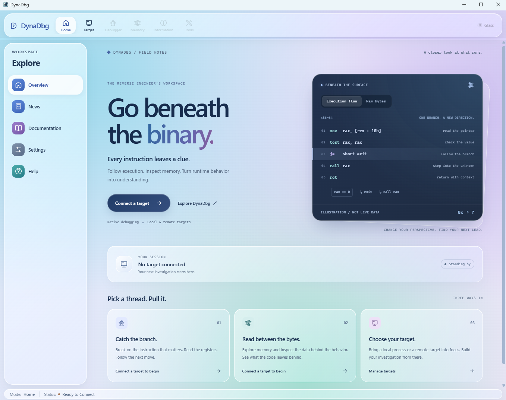
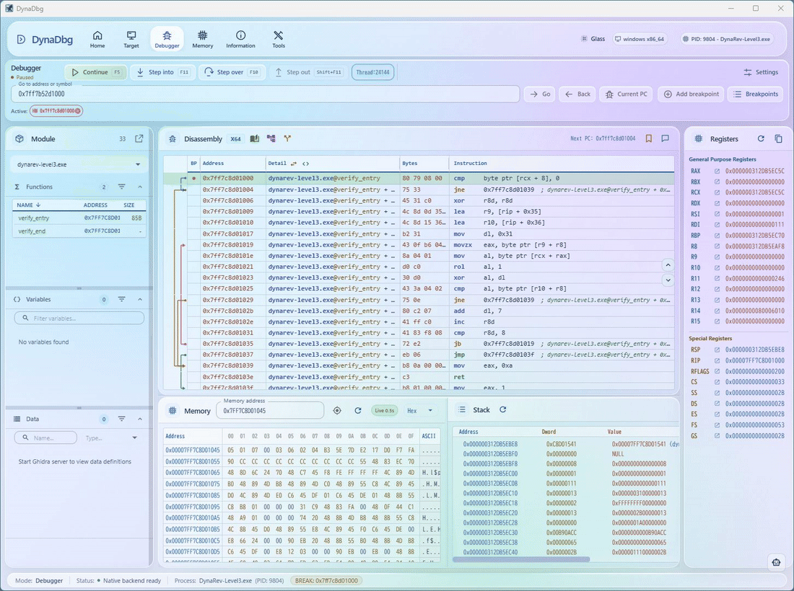
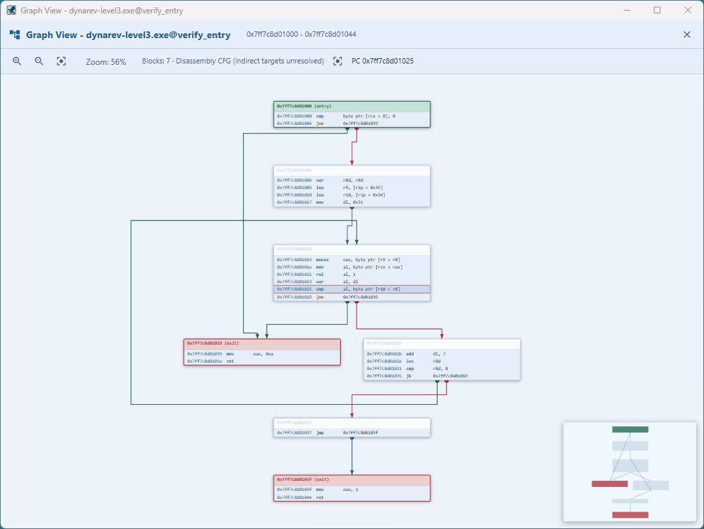
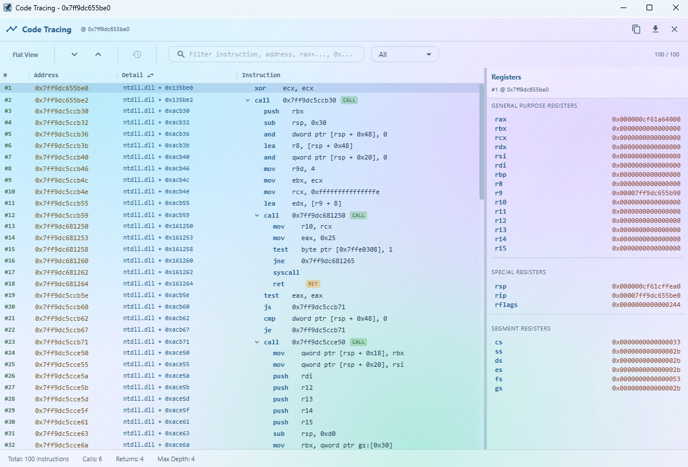
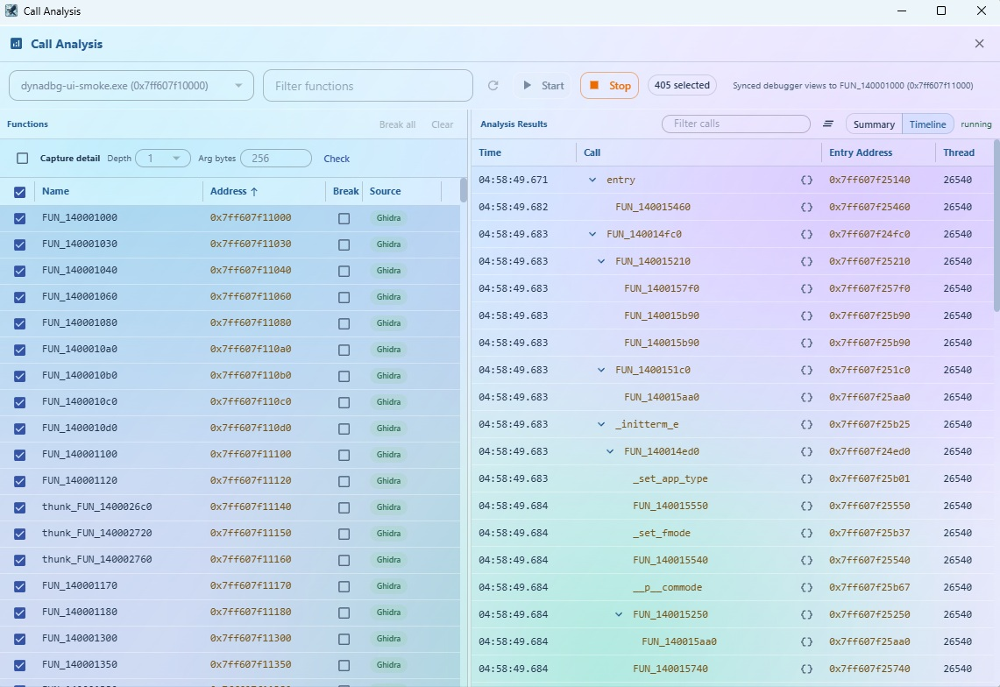

# DynaDbg

A cross-platform GUI debugger for dynamic binary analysis.

<strong>Currently available for Windows x64 only.</strong>

### [Download the latest Windows x64 binary](https://github.com/DoranekoSystems/dyna-dbg/releases/latest)

  

## Debugger

Disassembly, memory, and stack inspection in one focused workspace.

## Graph View

Follow branches and loops through an interactive control-flow graph.

## Code Tracing

Record executed instructions and inspect register state along the trace.

## Call Analysis

Track function activity and review call counts in real time.

## Highlights

- Native process debugging
- Disassembly, memory, and stack views
- Breakpoints and step execution
- Interactive control-flow Graph View
- Code tracing and call analysis
- Ghidra integration

## Availability

DynaDbg is currently available for **Windows x64 only**.

## License

DynaDbg is proprietary software and is **not open source**. All rights reserved.
